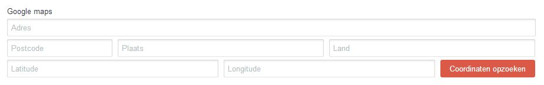
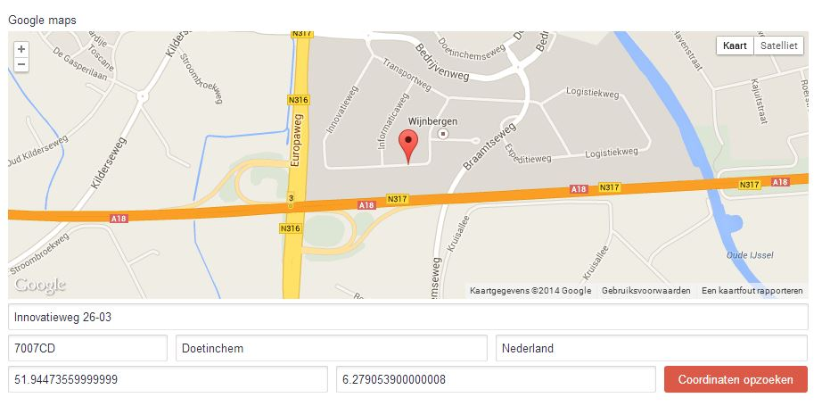
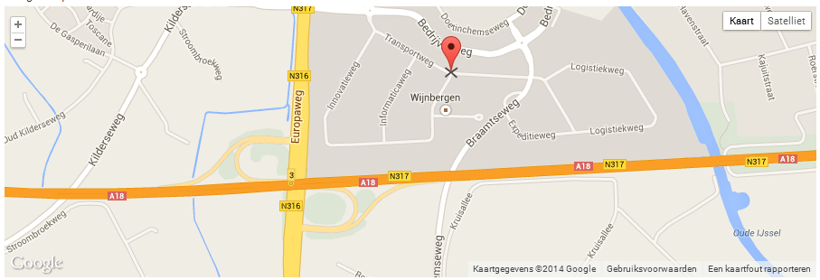

# Am Maps plugin for Craft CMS

## How does it look in the backend?

This plugin will add a new fieldtype called "Geo Mapper" that'll allow you to easily save addresses combined with the latitude and longitude.

Once you've added an address in the given fields and press the button to get the coordinates, Google Maps will be shown and a marker will display the location.

You can drag the marker around to update the coordinates to pinpoint the location exactly where you want.

## How do I display the information on the frontend?

    
{{ entry.GeoMapperFieldName.address }}
    
{{ entry.GeoMapperFieldName.zip }}
    
{{ entry.GeoMapperFieldName.city }}
    
{{ entry.GeoMapperFieldName.country }}
    
{{ entry.GeoMapperFieldName.lat }}
    
{{ entry.GeoMapperFieldName.lng }}

## Contact

If you have any questions or suggestions, don't hesitate to contact us.
